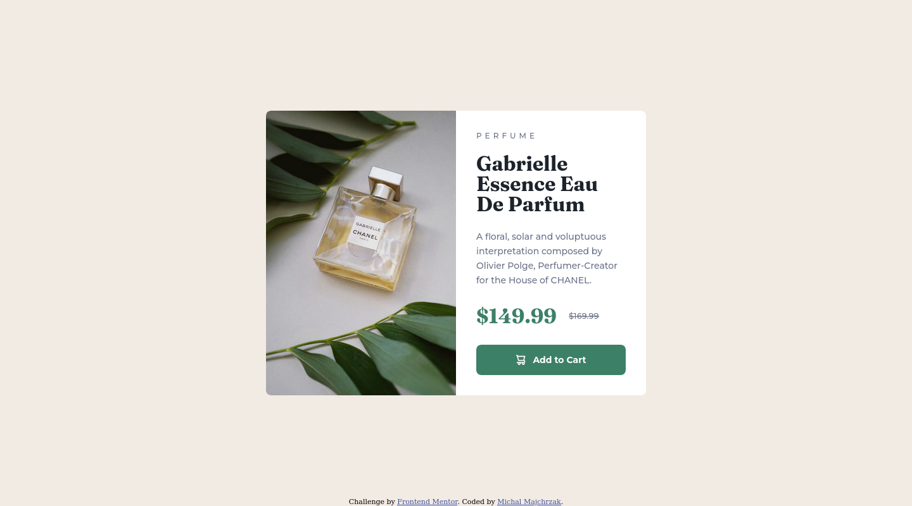

# Frontend Mentor - Product preview card component solution

This is a solution to the [Product preview card component challenge on Frontend Mentor](https://www.frontendmentor.io/challenges/product-preview-card-component-GO7UmttRfa).

## Table of contents

- [Overview](#overview)
  - [Screenshot](#screenshot)
  - [Links](#links)
- [My process](#my-process)
  - [Built with](#built-with)
  - [What I learned](#what-i-learned)
- [Author](#author)

## Overview

### Screenshot

#### Desktop


#### Mobile


### Links

- Solution URL: [github repository](https://github.com/Michal-Majchrzak/front-end-challenges/tree/master/newbie/product-preview-card-component-main)
- Live Site URL: [github pages](https://michal-majchrzak.github.io/front-end-challenges/newbie/product-preview-card-component-main/index.html)

## My process

### Built with

- Semantic HTML5 markup
- CSS custom properties
- Flexbox
- Mobile-first workflow

### What I learned

How to display different image based on screen size :

```html
<picture>
  <source media="(min-width: 600px)" srcset="./images/image-product-desktop.jpg" alt="perfume bottle">
  <source media="(min-width: 300px)" srcset="./images/image-product-mobile.jpg" alt="perfume bottle">
  
</picture>
```
To style image with CSS you have to target `img` element which is a child of `picture`

```css
picture > img {
  width: 100%;
  object-fit: contain;
  /*...*/
}
```

## Author

- Website - [Project Page](https://michal-majchrzak.github.io/front-end-challenges/)
- Frontend Mentor - [@Michal-Majchrzak](https://www.frontendmentor.io/profile/Michal-Majchrzak)
- Twitter - [@majchrzak_mike](https://twitter.com/majchrzak_mike)