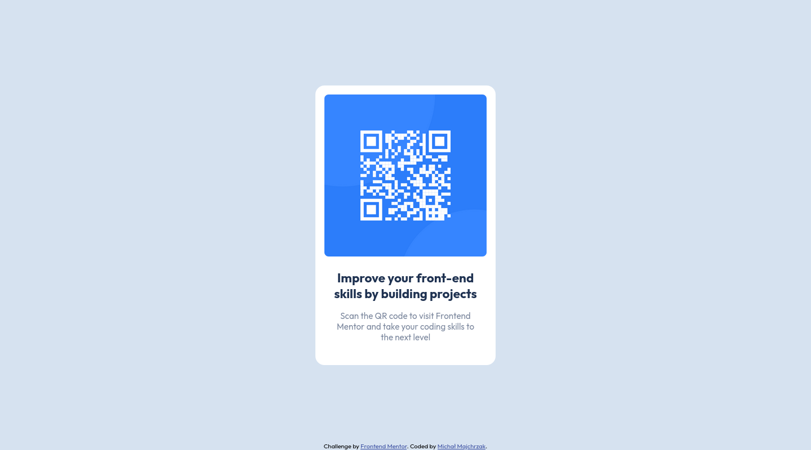

# Frontend Mentor - QR code component solution

This is a solution to the [QR code component challenge on Frontend Mentor](https://www.frontendmentor.io/challenges/qr-code-component-iux_sIO_H).

### Screenshot

#### Desktop

#### Mobile

### Built with

- HTML
- CSS

### What I learned

- Basics of CSS Grid.
- Usage of Firefox developer tools for testing how page is displayed on mobile devices.

### Continued development

- Find correct dimensions for border radius of card and code image (preferably percentage)
- Add soft shadow to the card
- Replace (where possible px units with other relative units)
- Try to better match solution fonts size with actual design

### Useful resources

- [CSS Grid Guide](https://css-tricks.com/snippets/css/complete-guide-grid/) - helped me with understanding of how grids work and helped with centering content both on Desktop and Mobile

### Author

- Website - [Project Page](https://michal-majchrzak.github.io/front-end-challenges/)
- Frontend Mentor - [@Michal-Majchrzak](https://www.frontendmentor.io/profile/Michal-Majchrzak)

### Links

- Live Site URL: [michal-majchrzak.github.io](https://michal-majchrzak.github.io/front-end-challenges/newbie/qr-code-component-main/index.html)
